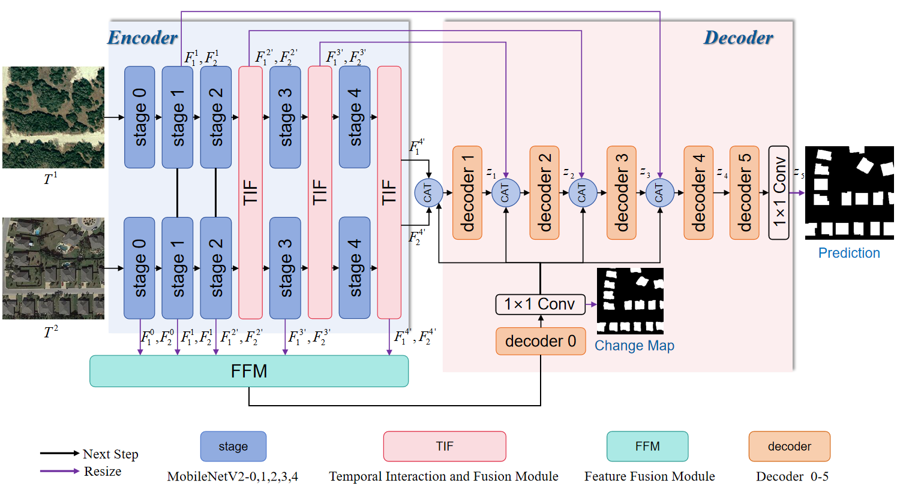
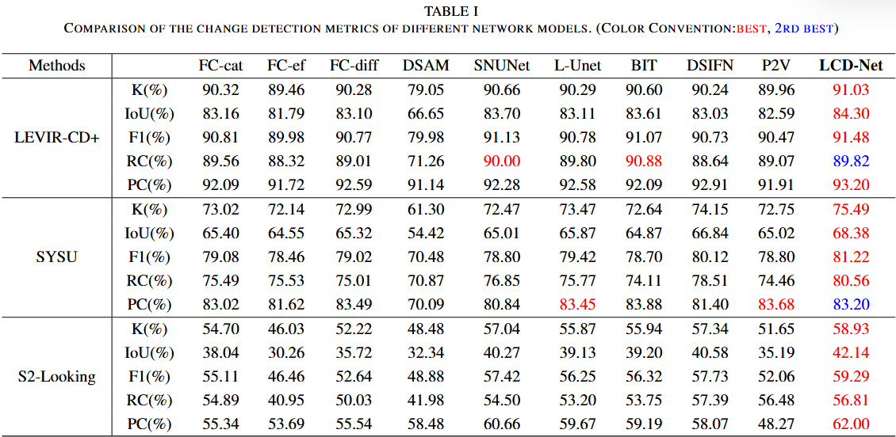
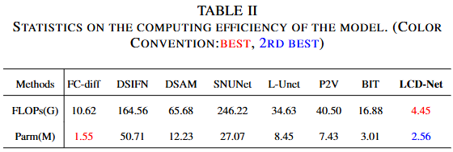
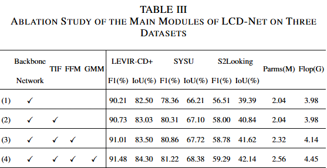
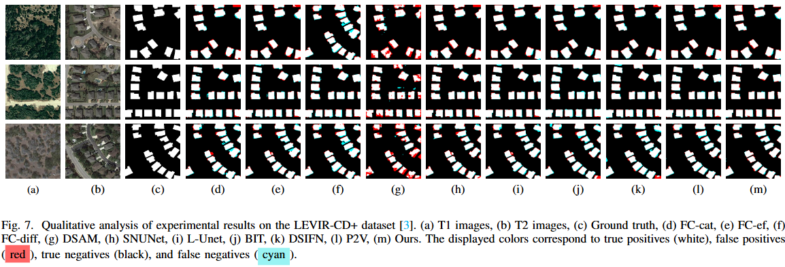
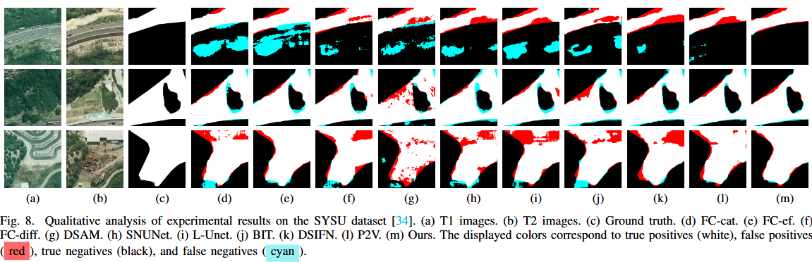
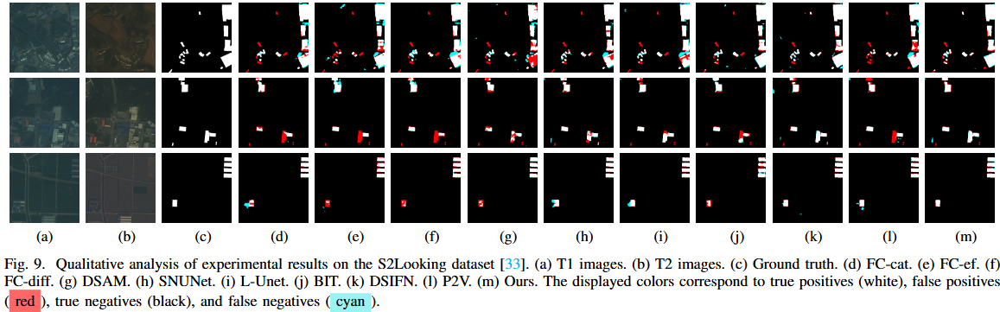
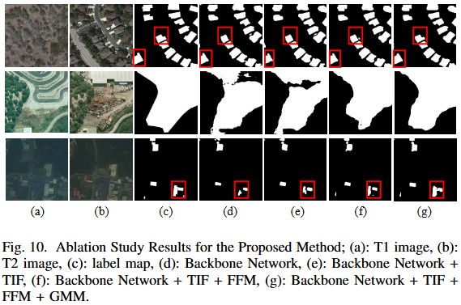

# LCD-Net: A Lightweight Remote Sensing Change Detection Network Combining Feature Fusion and Gating Mechanism
The proposed LCD-Net architecture.

## Requirements

- Python 3.8
- Pytorch 1.8.0
- Torchvision 0.9.0
- OpenCV 4.5.3.56
- TensorboardX 2.4
- Cuda 11.3.1
- Cudnn 11.3

## Training and Test Process
```bash
python train.py --epoch 50 --batchsize 8 --gpu_id '1' --data_name 'LEVIR' --model_name 'LCD_Net'

python test.py --gpu_id '1' --data_name 'S2Looking' --model_name 'LCD_Net'
```

## Dataset Path Setting

Make sure your dataset follows this structure:
|- LEVIR-CD+ or SYSU or S2Looking 

     |--train  
          |--A  (First temporal image)  
          |--B  (Second temporal image)  
          |--label (Ground truth)  
          
     |--val  
     
     |--test

Where A contains images of the first temporal image, B contains images of the second temporal image, and label contains ground truth maps.







